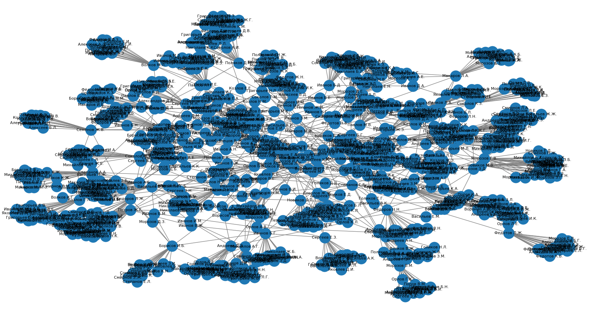

# Анализ графа друзей во ВКонтакте

## Описание проекта
Проект выполняет сбор данных о друзьях и друзьях друзей во ВКонтакте для членов учебной группы.  
На основе полученных данных строится граф социальных связей и рассчитываются показатели центральности:
- **Посредничество (Betweenness Centrality)**;
- **Близость (Closeness Centrality)**;
- **Собственный вектор (Eigenvector Centrality)**.

Метрики вычисляются **только для участников учебной группы**, указанных в файле `logins.py`.  
Друзья и друзья друзей участвуют в структуре графа, но для них метрики не рассчитываются.  
После вычислений результаты визуализируются в виде графа.

---

## Структура проекта
- `part1.py` — сбор данных через VK API;  
- `part2.py` — расчёт метрик центральности;  
- `visualize.py` — визуализация графа и результатов;  
- `logins.py` — хранение ID участников группы и безопасное подключение токена VK.

---

## Этапы работы

### 1) Сбор данных (`part1.py`)
- Для каждого ID из списка участников группы получаются их друзья.  
- Для каждого найденного друга собираются его друзья (второй уровень связей).  
- Формируется таблица рёбер «пользователь — друг» и список всех уникальных ID.

**Результат:** набор данных, описывающий связи между участниками и их окружением.

---

### 2) Расчёт метрик центральности (`part2.py`)
На основе полного графа вычисляются:
- **Betweenness Centrality** — показывает, через кого проходят кратчайшие пути;  
- **Closeness Centrality** — измеряет среднюю близость вершины ко всем остальным;  
- **Eigenvector Centrality** — отражает влияние вершины через связи с другими важными вершинами.

Расчёт выполняется **только для ID участников группы**, указанных в `logins.py`.  

**Результат:** вывод значений центральностей в консоль.

---

### 3) Визуализация (`visualize.py`)
- Строится граф социальных связей на основе собранных данных.  
- Размер или цвет вершин может соответствовать значениям центральности.  
- Итоговая визуализация сохраняется как изображение.

---
## Результат работы программы
Результатом работы программы является граф друзей бригады и друзей их друзей:

